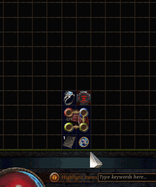

# Path of Exile item pricer

## What does it do
When the user right-clicks an item in a premium tab (or any tab), this handy program instantly outputs a buyout note containing the average price for that type of item.
Check it in action [here](https://www.youtube.com/watch?v=Y0WsRWPG4P8).

## Who is it for
Players who have little time on their hands and want to make some $$ without having to look up prices for every single item.
Be you a labrunner, who has dozens upon dozens of gems that need prices or a Uber Atziri farmer, who has amassed thousands of red tier maps, this program is perfect for you.

## How to get it running (as of v0.9)
1. Compile it yourself or download a compiled file from the [releases](https://github.com/siegrest/Pricer/releases/latest) page
2. Run the program and apply the desired settings
3. Pick a league
4. Pick a source (poe.ninja is accurate but poe.ovh provides a lot more variation)
5. Apply whatever settings
6. Click download
7. Click run
8. Right click or Ctrl+C an item (right click is advised)

## Settings explained (as of v0.9)
* "Lower price by #%" takes whatever price the item usually goes for and reduces its price by that % 
* "Send note" copies a buyout tag (eg. "~b/o 5 chaos") to your clipboard and pastes it
* "Send enter" sends enter after sending the note, applying the price instantly
* "PoePrices Fallback" allows normal/magic/rare items to be prices with the help of [poeprices](https://www.poeprices.info/) if there were no matches in the local database
* "Show pricebox" spawns a small window under the cursor containing the price of the item (can be closed by moved cursor away from window)
* "Mean"/"Median"/"Mode" button is only supported by poe.ovh atm, it can be used to switch pricing modes (only works before you download)
* Textbox with "120" in it is the delay in milliseconds that occurs between right clicking and pasting the buyout note. This is required as the price picking box in premium stash tabs takes some time to open. If your prices are not being pasted, try increasing this by 50ms

## What can it price
Uniques, gems, divination cards, maps, 6-links, currency, prophecies, essences, magic and rare items and pretty much everything.

## But I have PoeTradeMacro, why is this needed
Yeah and it's slow as s#!t.
You hover over the item, click the hotkey, wait a bunch for it to load and then get a list of the cheapest prices.
Mind you, those might very well be pricefixers.
Not with this program though.
The prices are accurate and represent the average over a certain period of time.
Alls you gotta do is right click and you got your price set!

## Where are the prices from
Three main sources: [poe.ovh](http://poe.ovh), [poe.ninja](http://poe.ninja) and [poeprices](https://www.poeprices.info/) (as a fallback).

## Words of warning
* The prices might are not always 100% accurate
* This is especially evident in sparsely found items (i.e league-specific uniques or certain gems)
* PriceBoxes probably don't work well with full-screen mode
* Prices in hardcore are generally not accurate as nobody plays there
